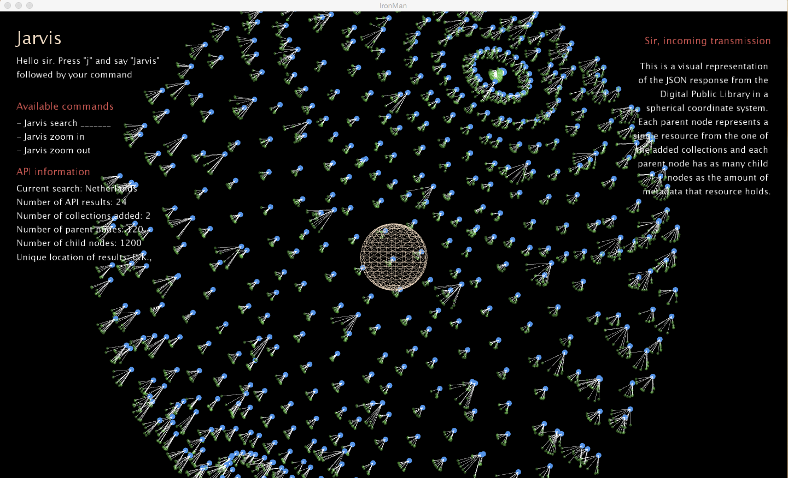
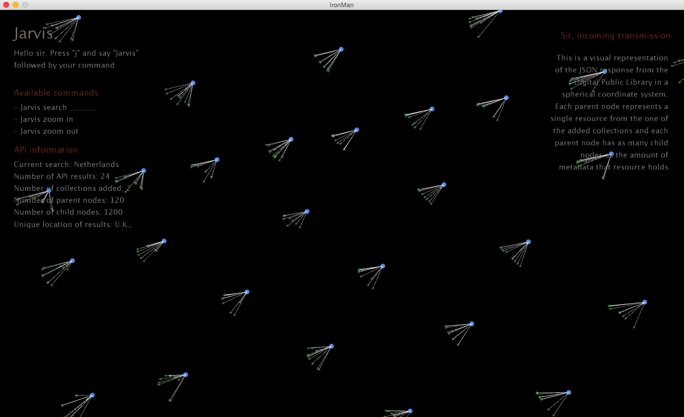
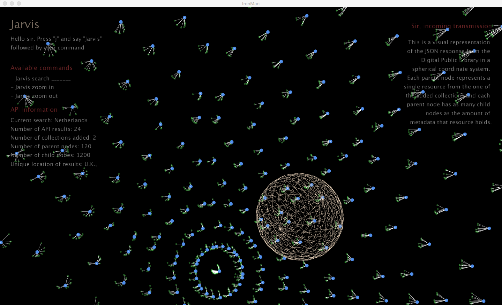

IronMan
================

IronMan-esque visualization using data from the dp.la API

#Github Repo
https://github.com/JonathanZWhite/IronMan

#Installation
`$ git clone git@github.com:JonathanZWhite/IronMan.git`

#Dependencies
[Processing - Processing is a programming language, development environment, and online community](http://www.processing.org/)

#Usage
Go into /demos and run the compatible program.

#Screenshots

#Troubleshooting
- If you the visualization is not working in the demo for PC users, try switching to either the 32 or 64 versions.
